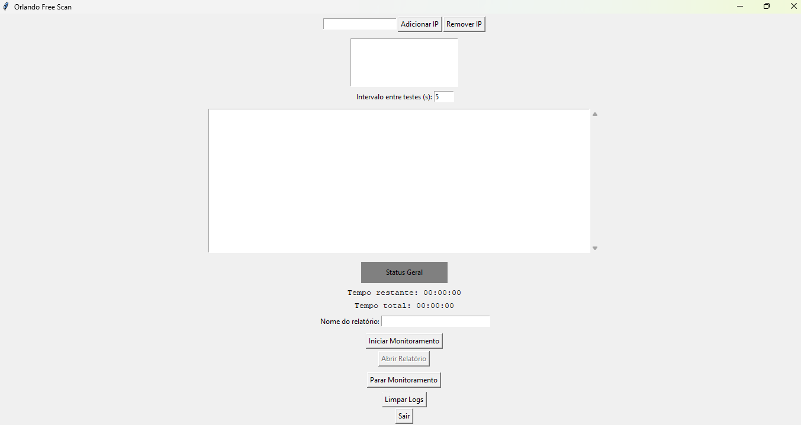

# OrlandoFreeScan

<p align="center">
  
</p>

<h1 align="center">Orlando Free Scan</h1>
<p align="center">Monitoramento de IPs com interface gráfica</p>

---

## 🚀 Recursos

- ✅ Verificação de múltiplos IPs com ping.
- 💻 Exibição de hostname automaticamente.
- 📁 Geração automática de relatórios em `.txt`.
- 🖼️ Interface amigável.
- ⏱️ Controle de tempo de execução e intervalo entre verificações.
- 🟢 Indicador de status visual direto na interface.
- 📂 Botão para abrir o relatório diretamente do app.

---

## 📷 Screenshot

<p align="center">
  
</p>

---

## 🧰 Requisitos

- Python 3.9+
- Bibliotecas padrão: `tkinter`, `socket`, `subprocess`, etc.

---

## 🛠️ Instalação

```bash
git clone https://github.com/thizinrodrigues/orlandoFreeScan.git
python orlando_free_scan.py

Ou utilize o executável da aplicação.

---

## 🧰 RELATÓRIO DE MONITORAMENTO DE IPs

Relatório gerado em: 2025-04-29 10:23:45

IPs Monitorados:
- 192.168.0.10
- 192.168.0.20

RESULTADOS:

🕒 Rodada 1 - 2025-04-29 10:23:46
✅ 192.168.0.10 (host1.local) está ONLINE
❌ 192.168.0.20 (host2.local) está OFFLINE

